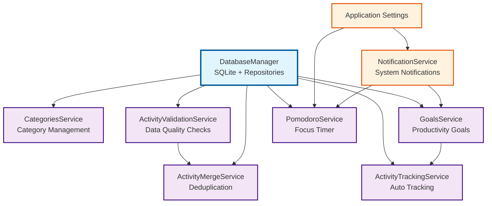
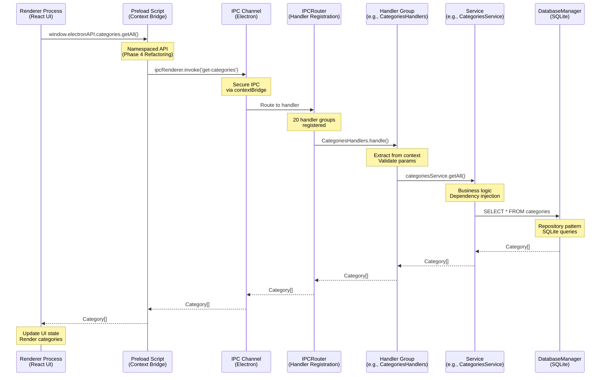
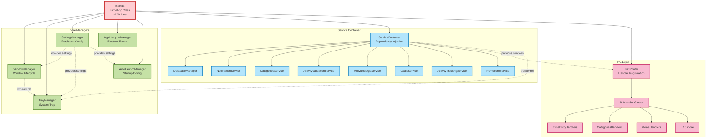
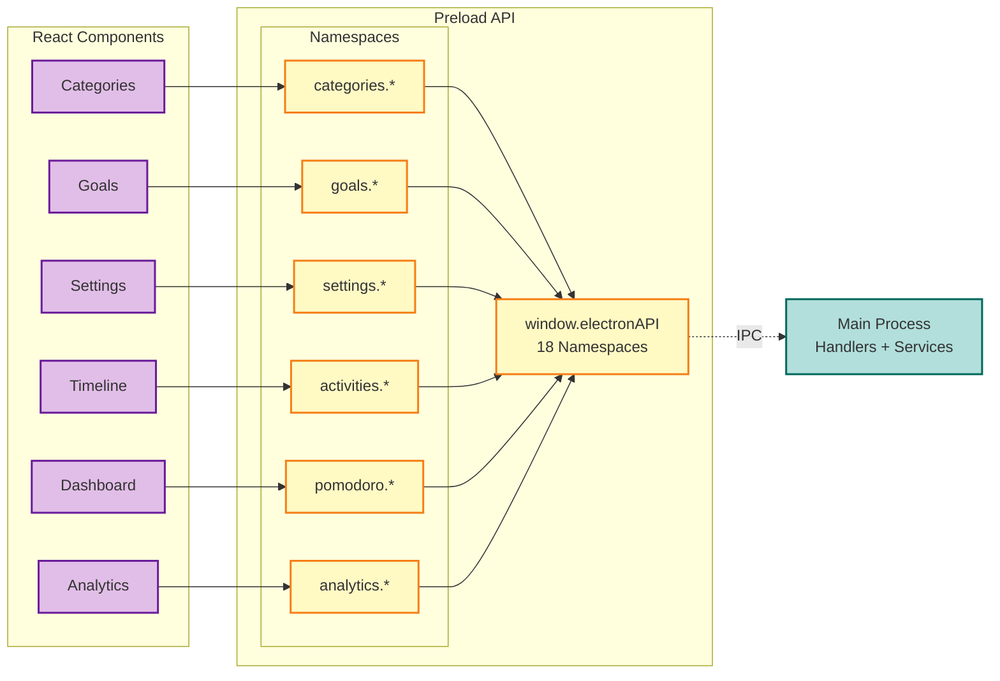
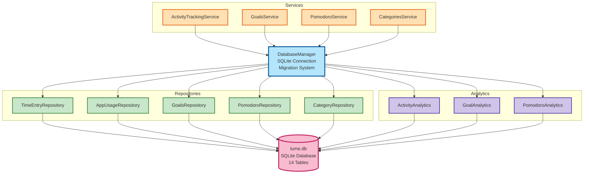
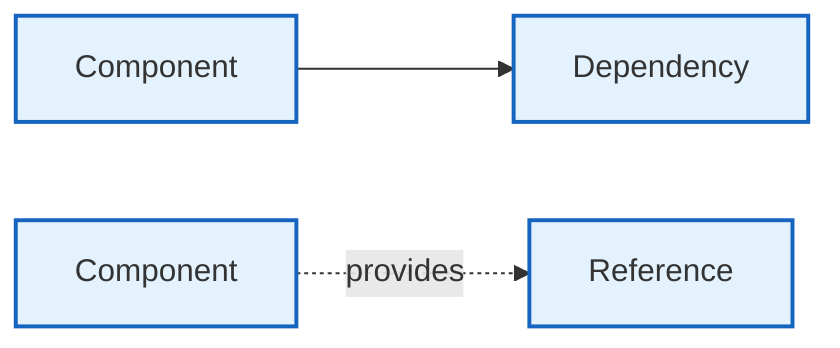

# Lume Architecture Diagrams

This document contains all architecture diagrams for the Lume application, rendered using Mermaid syntax.

---

## 1. Service Dependency Graph

Shows the dependency relationships between the 8 services in the ServiceContainer.



**Initialization Order**:
1. DatabaseManager (root)
2. NotificationService (settings)
3. CategoriesService (DB)
4. ActivityValidationService (DB)
5. ActivityMergeService (DB + validation)
6. GoalsService (DB + notifications)
7. ActivityTrackingService (DB + goals)
8. PomodoroService (DB + notifications)

---

## 2. IPC Architecture Flow

Shows the complete request/response flow from renderer to main process.



**Key Points**:
- **Renderer**: Type-safe API via TypeScript interfaces
- **Preload**: Exposes limited, secure API to renderer
- **IPC**: Electron's inter-process communication
- **Router**: Centralizes handler registration (Phase 2)
- **Handlers**: 20 groups organized by feature (Phase 2)
- **Services**: Business logic with dependency injection (Phase 3)
- **Database**: Persistent storage via SQLite

---

## 3. Main Process Architecture

Shows the high-level structure of the main process.



**Responsibilities**:
- **LumeApp**: Orchestrates initialization, minimal logic
- **Core Managers**: Window, tray, settings, lifecycle, auto-start
- **ServiceContainer**: Manages 8 services with DI (Phase 3)
- **IPC Layer**: Routes renderer requests to handlers (Phase 2)

---

## 4. Refactoring Journey Timeline

Shows the 5-phase refactoring process over 5 weeks.

```mermaid
timeline
    title Lume Refactoring Journey (5 Weeks)

    section Week 1: Phase 1
        POC : PomodoroTimerHandlers
            : Extracted 1 handler as proof of concept
            : Validated IPCRouter pattern
            : ~50 lines moved from main.ts

    section Week 2: Phase 2
        IPC Handlers : 20 handler groups in 4 batches
            : Batch 1 - Simple CRUD (5 handlers)
            : Batch 2 - Service-based (5 handlers)
            : Batch 3 - Complex queries (5 handlers)
            : Batch 4 - Data quality (5 handlers)
            : ~600 lines moved from main.ts

    section Week 3: Phase 3
        Service Container : 8 services with DI
            : DatabaseManager (root)
            : 7 specialized services
            : Dependency injection pattern
            : 32 unit tests written
            : ~300 lines refactored

    section Week 4: Phase 4
        Preload API : Namespaced API structure
            : 91 flat methods → 18 namespaces
            : Hybrid API (backward compatible)
            : Context bridge security
            : TypeScript interfaces
            : ~350 lines organized

    section Week 5: Phase 5
        Documentation : Cleanup & docs
            : JSDoc for 36+ public APIs
            : ARCHITECTURE.md (2000+ lines)
            : Mermaid diagrams (4 diagrams)
            : Updated CONTRIBUTING.md
            : Removed deprecated code
```

**Results**:
- **Before**: main.ts = 2106 lines
- **After**: main.ts = ~220 lines
- **Reduction**: ~90% smaller main file
- **Benefits**: Better testability, maintainability, discoverability

---

## 5. Component Architecture (Renderer Process)

Shows how React components interact with the Electron API.



**Migration Path** (Phase 4):
- Old: `window.electronAPI.getCategories()` ❌
- New: `window.electronAPI.categories.getAll()` ✅

---

## 6. Database Layer Architecture

Shows the repository pattern and database organization.



**Features**:
- **Repositories**: CRUD operations, type-safe queries
- **Analytics**: Complex aggregations and statistics
- **Migrations**: Versioned schema updates
- **Transactions**: ACID guarantees via better-sqlite3

---

## Legend



- **Solid arrows** (→): Direct dependencies
- **Dotted arrows** (⇢): Provides reference or data
- **Subgraphs**: Logical grouping of related components

---

**Last Updated**: 2025-10-14
**Generated for**: Lume v2.5.4
**Related**: See [ARCHITECTURE.md](ARCHITECTURE.md) for detailed documentation
